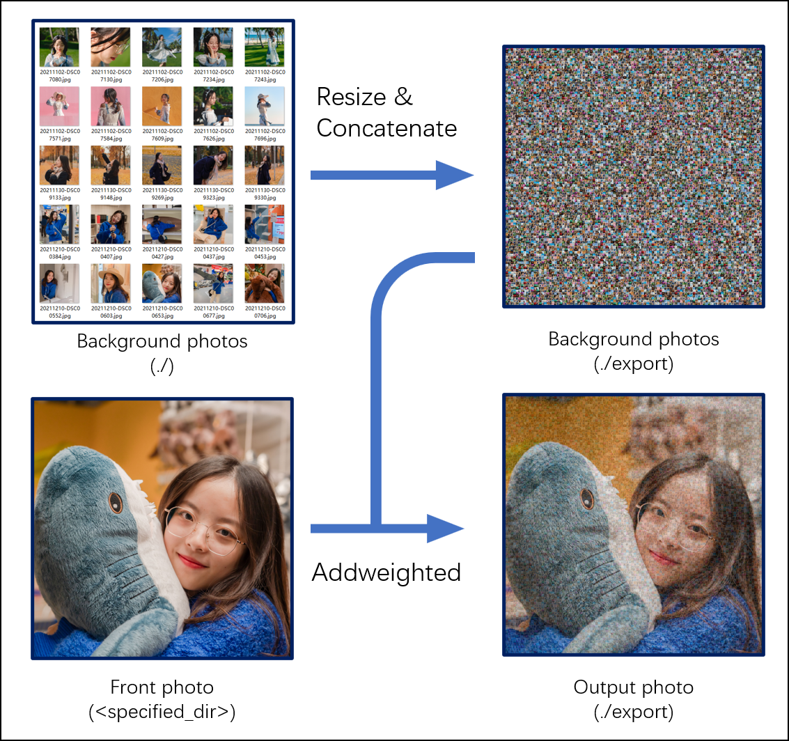

# Photowall Generator Instruction
## Background
A little gift for girlfriend on Valentine‘s Day. This tool uses OpenCV-Python to create an output photo consisting of 
multiple chosen background photos. Initially, Pillow (PIL) was used but the performance wasn't satisfying.



## Environment
* Windows 11 64bit
* Miniconda
* Python-3.7
* OpenCV
Detailed environment configuration is specified in [requirements.txt](./requirements.txt)
## Installation
1. You may first install [Miniconda](https://docs.conda.io/en/latest/miniconda.html)
2. Run code in you cmd
```commandline
conda intsll --yes --file requirements.txt` 
```
or
```commandline
pip install -r requirements.txt
```
## Usage
Config and run photos.py in IDE.

## Maintainer
[Haoyang Wu | riafmz@gmail.com](https://github.com/3rd-Musketeer)

## License
[MIT](./readme/LICENSE) &copy; Haoyang Wu
